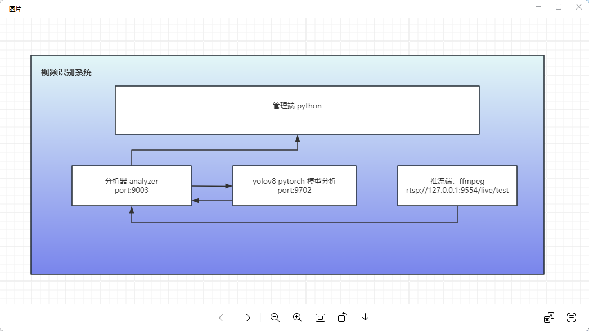
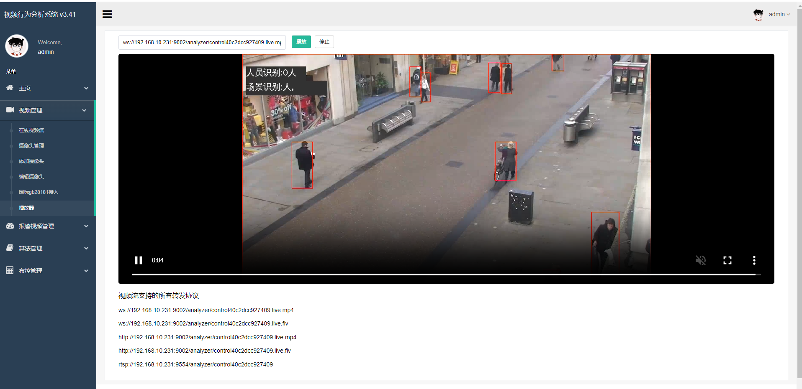
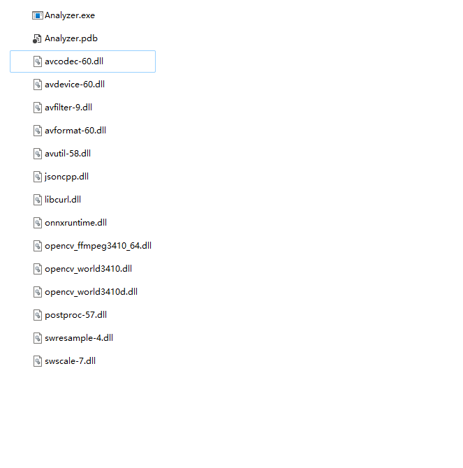
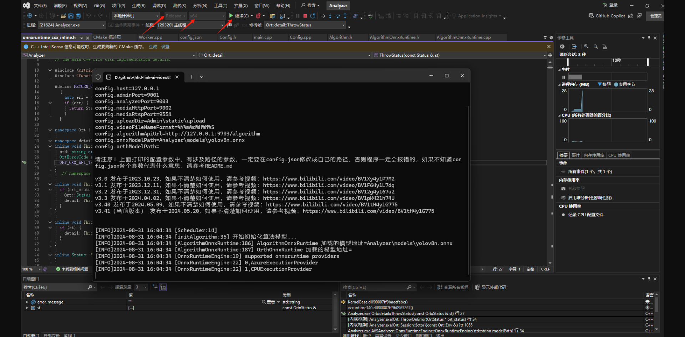
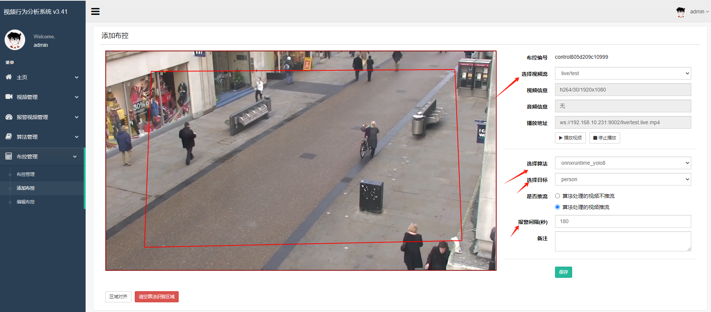

# cwq-public-yolov8 
视频ai识别项目

### 整个YoloV8视频识别系统主要包括：admin管理端，media流媒体端，分析端analyzer(c++), 模型端yolo


效果图：


### 1、admin 启动
 进入到admin目录下执行：

#### windows 创建python虚拟环境
~~~
# 创建虚拟环境
python -m venv venv

# 切换到虚拟环境
venv\Scripts\activate

# 更新虚拟环境的pip版本
python -m pip install --upgrade pip -i https://pypi.tuna.tsinghua.edu.cn/simple

# 在虚拟环境中安装依赖库
python -m pip install -r requirements.txt -i https://pypi.tuna.tsinghua.edu.cn/simple

//启动后台管理服务
python manage.py runserver 0.0.0.0:9001

后台管理服务：9001
流媒体服务器：9002
分析器：9003

//管理员用户
admin/admin888

~~~

### 2、analyzer 启动
需要自己将第三方库的文件加到Release文件夹当中，手动的将库文件加载到C++项目当中。将第三方库当中的bin目录下的所有.dll文件复制到
下面这个文件夹当中
..\Analyzer\x64\Release

```shell
## 使用Visual stadio启动c++项目 打开

Analyzer.sln
```
启动后的界面（端口默认9703）：



### 3、mediaServer 启动
点击mediaServer下的exe启动即可

### 4、启动yolo
```shell
### 创建虚拟环境
python -m venv venv

### 切换到虚拟环境
venv\Scripts\activate

### 安装 pytorch-cpu版本依赖库
pip install -r requirements.txt -i https://pypi.tuna.tsinghua.edu.cn/simple

## 启动服务
python main.py

默认端口: 9702
```

### 5、使用过程中的设置如何布控，如何选定识别算法等，如下：



